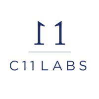

*Turning data into strategic resources through mathematics, programming, and automation.*
*Capital allocation · Investment strategies · Automated trading*

## ⚡ Tech Stack

**Languages**

**Infrastructure & Data**

**AI-Native** · 🤖 Claude Code · Codex · Cursor · Conductor

## 🏆 Career Highlights

- Contributed to driving **$331.2M** MON deposits at [ShMonad](https://shmonad.xyz/) launch — 10× avg competitor — 1st protocol on Monad `FastLane Labs`
- Market research, KPIs analysis, and automated monitoring for **Atlas** — advancing it to be **acquired by Chainlink** (Jan 2026) `FastLane Labs`
- Built Points System tracking live interactions of **200k** users across ShMonad & partners · **99.9%** uptime `FastLane Labs`
- **0 → high 6-figure** annual net PnL `C11 Labs`
- Scaled team **1 → 4** engineers, building algorithmic trading systems from scratch `C11 Labs`
- Pushed company valuation to **7 figures** `C11 Labs`

## 💼 Professional Experience

**Head of Research** — [FastLane Labs](https://www.fastlane.xyz/)
Aug 2024 – Present · Los Angeles (Remote)

- Set research direction and ship production systems for MEV-aware infrastructure across validator tooling, order flow auctions, and monitoring
- Drove [**ShMonad**](https://shmonad.xyz/) **LST launch to $331.2M in deposits** — ~10× the average competitor — within two weeks
- Advanced **Atlas to market readiness** via KPIs research and order-flow auction analysis; acquired by **Chainlink** (Jan 2026)
- Architected **Points System backend**: 200k addresses, 10 protocols, 99.9% uptime
- Co-authored research on execution quality in permissionless order flow auctions ([arXiv:2503.05338](https://arxiv.org/abs/2503.05338))

 

**Head of Execution** — C11 Labs ([Maven11](https://maven11.com/))
Mar 2022 – Aug 2024 · Amsterdam (Hybrid)

- First employee; scaled fund PnL from **zero to high six-figure** annual net
- Grew team from **1 to 4**, building algorithmic trading systems from scratch
- Market-making and MEV strategies, pushing valuation into **seven figures**
- Built DevOps monitoring and alerting for live trading

 

🔒 **Trading Analyst** — Stealth Startup
Sep 2021 – Mar 2022 · Amsterdam

- Designed unhedged arbitrage strategies on DEXs alongside senior engineers and traders (IMC)
- Built automated daily trading analytics pipeline (Python, SQL, Web3)
- Computed daily NAV and trading positions for fund management

## 🎓 Education

**MSc Banking & Quantitative Finance**
Utrecht University · Netherlands · 2020 – 2021

- Thesis: *"Should Cryptocurrencies Be Included in a Well-diversified Portfolio?"*
- Algorithms in Finance, Risk Management, Econometrics, Sustainable Finance
- Option Market Making (Python), Trading Algo design, Credit Risk Modelling

 

**BSc Financial Markets & Institutions**
Catholic University of the Sacred Heart · Milan · 2016 – 2019

- Dissertation: *"Portfolio Diversification: An Empirical Analysis"* — 3/3
- Quantitative Methods, Portfolio Management, Corporate Finance, Derivatives

## 📄 Publications

**"Using Failure Costs to Guarantee Execution Quality in Competitive and Permissionless Order Flow Auctions"**

When not building, you'll find me snowboarding 🏂, jet-skiing 🌊, or photographing wildlife 📷 on solo trips around the world.

